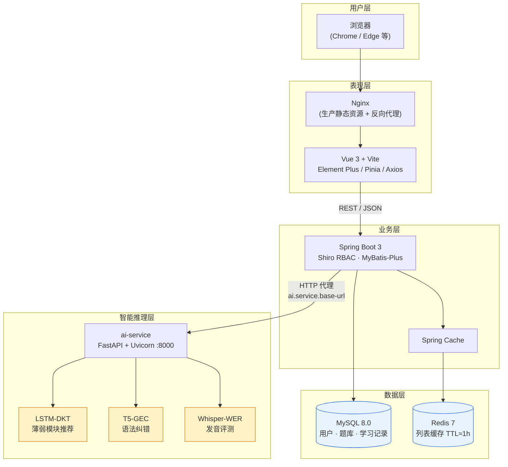
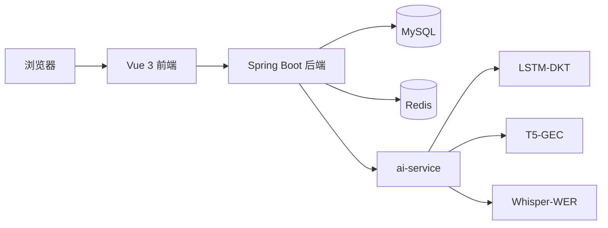

# 图 2-1 系统技术架构图

> **论文图题（建议）**：图 2-1 英语学习系统技术架构  
> **导出方式**：在 VS Code 安装 Mermaid 插件预览后截图；或使用 [Mermaid Live Editor](https://mermaid.live) 粘贴下方代码导出 PNG/SVG。

## 架构说明（图注可参考）

1. **用户层**：学习者与管理员通过浏览器访问系统。  
2. **表现层**：Vue 3 单页应用负责交互；Docker 部署时由 Nginx 托管构建产物并转发 API。  
3. **业务层**：Spring Boot 处理认证授权、题库与学习记录等业务；高频只读列表经 Redis 缓存。  
4. **数据层**：MySQL 持久化结构化数据；Redis 作为缓存，写操作触发 `@CacheEvict` 失效。  
5. **智能推理层**：独立 Python 服务加载三类模型，Java 后端通过 HTTP 调用，避免 JVM 内嵌深度学习框架。

## 简化版（版面较窄的论文用）

