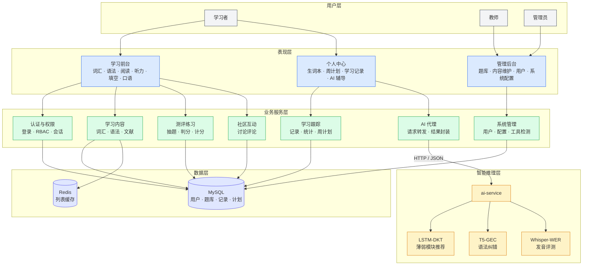
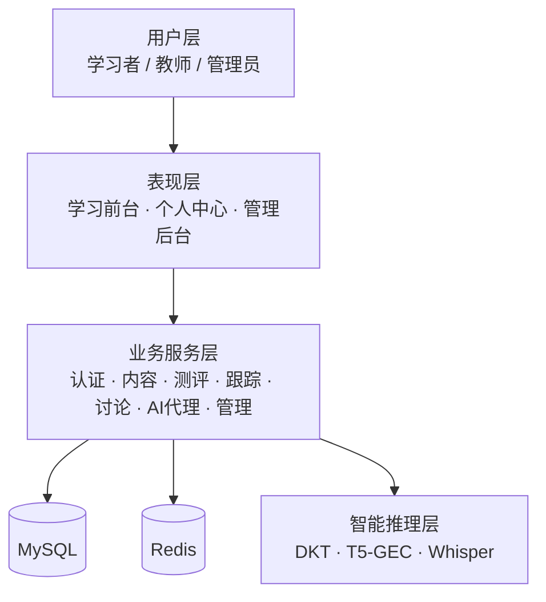

# 图 3-1 系统逻辑总体架构图

> **论文图题**：图 3-1 英语学习系统逻辑总体架构  
> **导出 PNG**：在项目根目录执行  
> `npx -y @mermaid-js/mermaid-cli -i docs/figures/fig-3-1-system-logic-architecture.mmd -o docs/figures/fig-3-1-system-logic-architecture.png -b white -w 1200`  
> 或粘贴下方代码到 [Mermaid Live Editor](https://mermaid.live) 导出。

## 完整版（论文推荐）

## 图注（可写入论文）

1. **用户层**：三类角色共用同一 Web 入口，按 RBAC 展示不同菜单。  
2. **表现层**：学习前台负责练习与展示；个人中心聚合生词本、计划与 AI 辅导；管理后台供教师与管理员维护内容与账号。  
3. **业务服务层**：Spring Boot 按领域拆分服务，完成鉴权、题库、记录、讨论等业务逻辑；AI 代理模块统一转发推理请求。  
4. **数据层**：MySQL 持久化结构化数据；Redis 缓存高频只读列表，写操作触发失效。  
5. **智能推理层**：独立 Python 服务加载深度学习模型，与 Web 业务解耦，便于模型单独升级与部署。

## 竖版简图（版面较窄时用）

