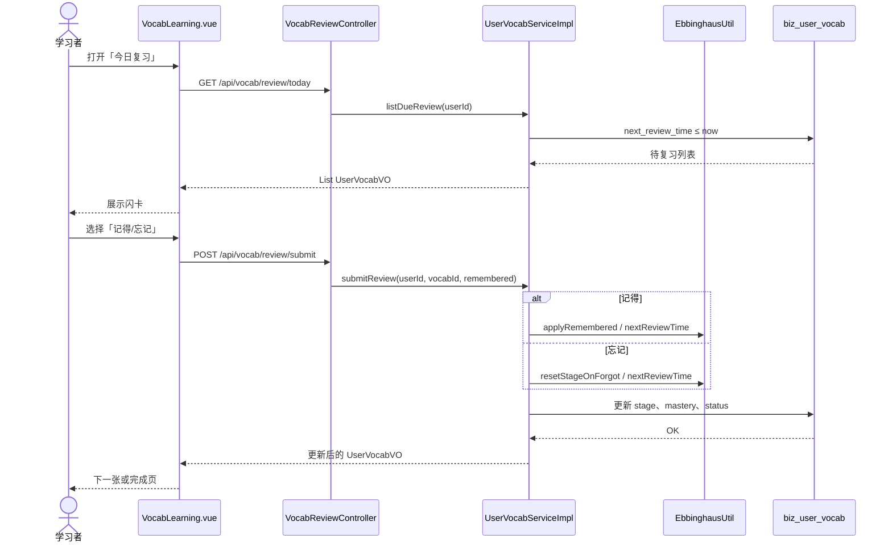

# 图 4-9 词汇复习流程序列图

> **论文图题**：图 4-9 词汇艾宾浩斯复习流程序列图  
> 导出：粘贴至 [Mermaid Live Editor](https://mermaid.live) 或 `npx @mermaid-js/mermaid-cli`。

```mermaid
sequenceDiagram
    actor U as 学习者
    participant V as VocabLearning.vue
    participant C as VocabReviewController
    participant S as UserVocabServiceImpl
    participant E as EbbinghausUtil
    participant DB as biz_user_vocab

    U->>V: 打开「今日复习」
    V->>C: GET /api/vocab/review/today
    C->>S: listDueReview(userId)
    S->>DB: next_review_time ≤ now
    DB-->>S: 待复习列表
    S-->>V: List UserVocabVO
    V-->>U: 展示闪卡

    U->>V: 选择「记得/忘记」
    V->>C: POST /api/vocab/review/submit
    C->>S: submitReview(userId, vocabId, remembered)
    alt 记得
        S->>E: applyRemembered / nextReviewTime
    else 忘记
        S->>E: resetStageOnForgot / nextReviewTime
    end
    S->>DB: 更新 stage、mastery、status
    DB-->>S: OK
    S-->>V: 更新后的 UserVocabVO
    V-->>U: 下一张或完成页
```
