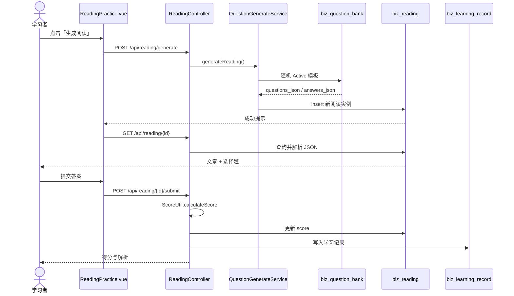

# 图 4-10 阅读测验流程序列图

```mermaid
sequenceDiagram
    actor U as 学习者
    participant R as ReadingPractice.vue
    participant RC as ReadingController
    participant QG as QuestionGenerateService
    participant BK as biz_question_bank
    participant BR as biz_reading
    participant LR as biz_learning_record

    U->>R: 点击「生成阅读」
    R->>RC: POST /api/reading/generate
    RC->>QG: generateReading()
    QG->>BK: 随机 Active 模板
    BK-->>QG: questions_json / answers_json
    QG->>BR: insert 新阅读实例
    BR-->>R: 成功提示

    R->>RC: GET /api/reading/{id}
    RC->>BR: 查询并解析 JSON
    BR-->>U: 文章 + 选择题

    U->>R: 提交答案
    R->>RC: POST /api/reading/{id}/submit
    RC->>RC: ScoreUtil.calculateScore
    RC->>BR: 更新 score
    RC->>LR: 写入学习记录
    RC-->>U: 得分与解析
```
