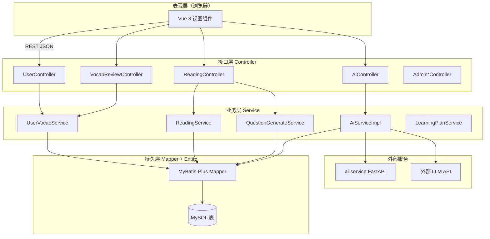

# 图 4-11 后端分层结构图（可选）

```mermaid
flowchart TB
    subgraph presentation["表现层（浏览器）"]
        Vue["Vue 3 视图组件"]
    end

    subgraph api["接口层 Controller"]
        UC[UserController]
        VC[VocabReviewController]
        RC[ReadingController]
        AC[AiController]
        ADM[Admin*Controller]
    end

    subgraph business["业务层 Service"]
        UVS[UserVocabService]
        RS[ReadingService]
        QGS[QuestionGenerateService]
        AIS[AiServiceImpl]
        LPS[LearningPlanService]
    end

    subgraph persistence["持久层 Mapper + Entity"]
        MBP[MyBatis-Plus Mapper]
        ENT[(MySQL 表)]
    end

    subgraph external["外部服务"]
        AI[ai-service FastAPI]
        LLM[外部 LLM API]
    end

    Vue -->|REST JSON| UC
    Vue --> VC
    Vue --> RC
    Vue --> AC

    UC --> UVS
    VC --> UVS
    RC --> RS
    RC --> QGS
    AC --> AIS

    UVS --> MBP
    RS --> MBP
    QGS --> MBP
    AIS --> MBP
    MBP --> ENT

    AIS --> AI
    AIS --> LLM
```
